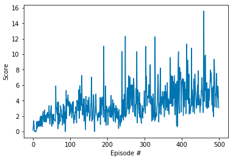

# Deep Reinforcement Learning Nanodgree 
## Project on Continuous Control

### Project Description

In this project, we train an agent to solve the Reacher Unity environment, in which a double-jointed arm can move to target location. A reward of +0.1 is provided for each step if the agent's hand is in the goal location. Thus, to maximize the reward, the goal of the agent is to maintain its position at the target location for as many time steps as possible. The environment is solved when the agent achieves an average reward of +30 over 100 consecutive episodes. 

In this project, we use an actor-critic algorithm, the Deep Deterministic Policy Gradients (DDPG) algorithm to train the agent.

### Environment Description

The state space of the environment consists of 33 variables corresponding to position, rotation, velocity, and angular velocities of the arm. Each action is a vector with four numbers, corresponding to torque applicable to two joints. Every entry in the action vector should be a number between -1 and 1.

### Learning Algorithm

Since the action of the agent is continuous, we adopt Deep Deterministic Policy Gradient (DDPG) algorithm, which is a model-free off-policy algorithm to train the agent. DDPG combines the ideas of DPG (Deterministic Policy Gradient) and DQN (Deep Q-Network) in which Actor and Critic, each having two neural networks: a regular network and a target network. The target networks are actually the copies of the regular networks but slowly learns, thus improving the stability in training. In this algorithm, The Actor network is used to determine the action given a state while the Critic network is used to estimate the Q-value for a pair of (`state, action`). We note that unlike the Advantage Actor-Critic, DDPG directly maps a `state` to the best `action` rather than providing the probability distribution across a discrete action space. This reduces the effort to discretize the action space, which is continuous in this project. The below figure presents the pseudo-codes of the DDPG algorithm (Image taken from “Continuous Control With Deep Reinforcement Learning” (Lillicrap et al., 2015)).

#### Experience Replay

Since DDPG adopts DQN, it also uses a replay buffer, which is a finite-sized memory (we have set the size of the reppay buffer to 100000) to store all the experience tuples (state, action, reward, next_state). At every time step, the algorithm randomly samples a mini-batch from the replay buffer to update the value and policy networks. In the code, we have set the mini-batch size to 128. It is worth recalling that experience replay helps to break the temporal/chronological correlation among state/action pairs in each training episode. Withouth experience replay, this correlation could lead to instability (oscillation or divergence of Q-Values) during training as small updates to Q-values may significantly change the policy.

#### Exploration 

As in other reinforcement learning algorithms, the agent trained with DDPG also explores the environment by selecting random actions rather than always using the best action it has learned. For discrete action spaces, exploration is done using epsilon-greedy that probabilistically selects a random action. For continuous action spaces, exploration is done by adding noise to the action itself. The original DDPG algorithm uses Ornstein-Uhlenbeck Process to add noise to the action. We keep using this approach in this project. Nevertheless, recent literature (see the references [1,2]) stated that this can also be done by using a Gaussian process. We have additionally implemented this approach in `agent.py` as an experimental option.  

#### Actor and Critic Networks

We define the Actor and Critic networks with fully-connected layers. Except the input and output layers, the networks have 3 hidden layers. The detailed architecture of the Actor and Critic networks is as follows:

##### Actor network

Input layer: 33 nodes (corresponding to 33 variables of the state of the environment)

Hidden layer 1: 256 nodes

Hidden layer 2: 128 nodes

Hidden layer 3: 64 nodes

Output layer: 4 nodes (corresponding to the number of entries in the action vector of the agent)

##### Critic network

Input layer: 37 nodes (corresponding to 33 variables of the state of the environment and 4 variables of the action)

Hidden layer 1: 256 nodes

Hidden layer 2: 128 nodes

Hidden layer 3: 64 nodes

Output layer: 1 node (corresponding the Q-value)

We note that betwen hidden layer 1 and hidden layer 2 of both networks, we add a batch normalization layer to standardizes the inputs to hidden layer 2 for each mini-batch. This helps further stabilize the learning process since activations can vary a lot due to fluctuating values of input state. For the Critic network, rather than concatenating the state and action before feeding to hidden layer 1, we first feed the state to hidden layer 1 and then concatenate the output of hidden layer 1 with the action to feed in hidden 2. It is also to be noted that hidden layer 3 for the Actor network is randomly initialized in the range (-0.003, 0.003). This allows us to avoid getting 1 or -1 output values in the initial stages, which would squash our gradients to zero, as we use the `tanh` activation for the output layer.

The implementation of the Actor and Critic networks is presented in `model.py`.

#### Experimental Results

All the training parameters are set in `agent.py`. The discount factor is set to 0.99 and the learning rate of Actor and Critic models is set to 1e-3. 

##### Results with small architecture of Actor and Critic networks

We have tested the algorithm with a small architecture of the Actor and Critic networks, which have 2 hidden layers with 128 and 64 hidden nodes without any batch normalization. However, we have not successfully trained the agent, thus not achieving the expected reward. In the figure below, we present the evolution of the reward with respect to the training episodes. While we observed an increasing trend of the reward, the reward significantly oscillates. After 500 episodes, we obtained an average reward of only +5.   

##### Results with Ornstein-Uhlenbeck Process for Noise Generation

After modifying the network architectures and adopting the batch normalization layers, we achieve expected results. The agent can solve the environment after XXX episodes. In the figure below, we present the evolution of the reward along the training episodes. The results show that the reward quickly increases in the first 100 episodes, and the slowly increases until achieving expected reward (>=+30). 

##### Results with Gaussian Process for Noise Generation

We have also trained the agent using Gaussian Process for generating noise to add to the action. As shown in the figure below, we achieved similar performance trends compared to the agent using Ornstein-Uhlenbeck Process.

#### Future Directions

In this project, we used only one agent. This makes the learning process a bit slow. It takes more than XXX episodes to achieve the expected reward. We expect that with multiple agents learning simultaneously, the environment would be solved with a shorter time (smaller number of episodes). With multiple agents interacting with the environment and exploring different actions (via noise added), thus providing more experience for the agents to learn.

It is also interesting to implement more advanced algorithms and compared their performance with DDPG. With continuous action space, we can implement the following algorithms to sove this problem.

Distributed Distributional Deterministic Policy Gradients [2]

Asynchorous Methods for Deep Reinforcement Learning [3]

Proximal Policy Optimization Algorithms [4]

#### References

[1] https://arxiv.org/pdf/1802.09477.pdf

[2] https://arxiv.org/pdf/1804.08617.pdf

[3] https://arxiv.org/abs/1602.01783

[4] https://arxiv.org/abs/1707.06347
